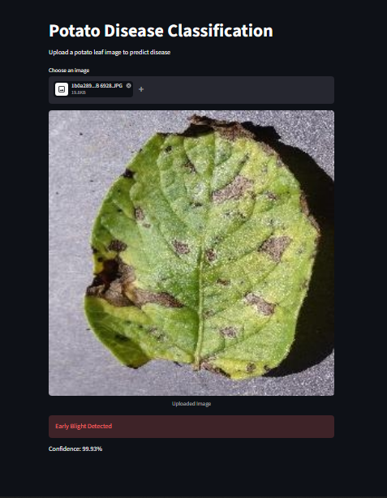
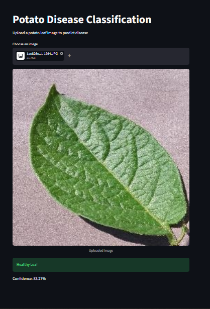
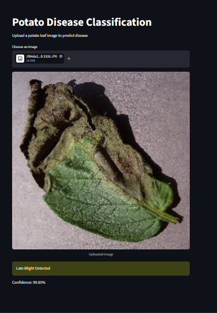

#  Potato Disease Classification using CNN

A deep learning web application that classifies potato leaf diseases using a Convolutional Neural Network (CNN) and is deployed using Streamlit.

---

###  Project Overview

This project detects potato leaf diseases from uploaded images and classifies them into three categories:

- Healthy
- Early Blight
- Late Blight

The model is trained on the PlantVillage dataset and integrated into a Streamlit web app for real-time predictions.

---

###  Dataset

- Dataset: PlantVillage
- Source: https://www.kaggle.com/arjuntejaswi/plant-village

---

###  Tech Stack

- Python
- TensorFlow / Keras
- NumPy
- Streamlit
- Pillow (PIL)

---

##  How It Works

1. Upload a potato leaf image  
2. Model processes the image (resize + normalize)  
3. CNN extracts features  
4. Prediction is generated with confidence score  

---

### Output

1. Early Blight:
   

2. Healthy leaf:
   

3. Late Blight:
   

---

## Why This Project Matters

- Helps farmers detect diseases early
- Reduces crop loss
